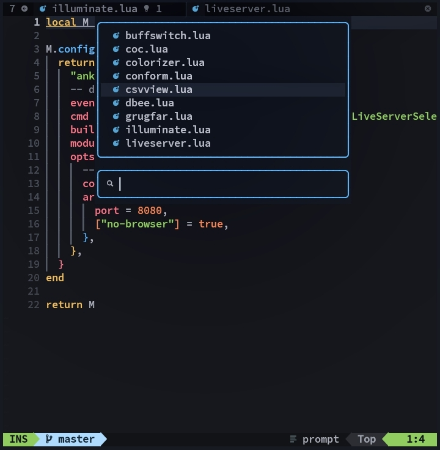

<div align="center">

<h1>buffswitch.nvim</h1>

<p>A minimal floating buffer switcher for Neovim that lets you quickly browse, search, and jump between open buffers using a clean UI.</p>

</div>



### Features

- Floating buffer list UI
- Optional search/filter input
- File icons via nvim-web-devicons
- Keyboard navigation (Up/Down, Tab/S-Tab)
- Mouse support (click to select)
- Auto-centers on window resize
- Lightweight and fast

### Installation

lazy.nvim:

```lua
{
  "ankushbhagats/buffswitch.nvim",
  dependencies = {
    "nvim-tree/nvim-web-devicons",
  }
  config = true,
}
```

packer.nvim:

```lua
use({
  "ankushbhagats/buffswitch.nvim",
  requires = {
    "nvim-tree/nvim-web-devicons",
  },
  config = function()
    require("buffswitch").setup()
  end,
})
```

### Command

:BuffSwitch

### Keymaps

Navigation:

- Up / Down → move selection
- Tab / S-Tab → move selection
- Mouse click → select buffer

Actions:

- Enter → open buffer
- Esc / q / Ctrl-q → close

### Configuration

```lua
require("buffswitch").setup({
  search = true,
  prefix = ">", -- |  | 󰍟 | 
  position = "top", -- top | center
  border = "rounded", -- "single" | "double" | "rounded" | "shadow" | custom: { "┏","━","┓","┃","┛","━","┗","┃" }
  border_hl = "Function",
  keys = {
    forward = { "<Down>", "<Tab>" },
    backward = { "<Up>", "<S-Tab>" },
  },
})
```
